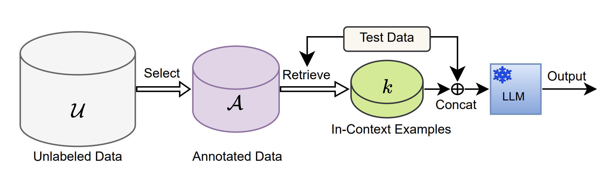

## Sub-SA: Strengthen In-context Learning via Submodular Selective Annotation

Published ECAI 2024 : https://arxiv.org/abs/2407.05693




Run Code:

	```
        python main.py  \
        --model_cache_dir models \
        --data_cache_dir datasets \
        --task_name rte \
        --selective_annotation_method diversity \
        --prompt_retrieval_method similar \
        --annotation_size 18 \
        --cuda_id 0 \
        --model_name EleutherAI/gpt-j-6B \
        --seed 1  \
	```

    
