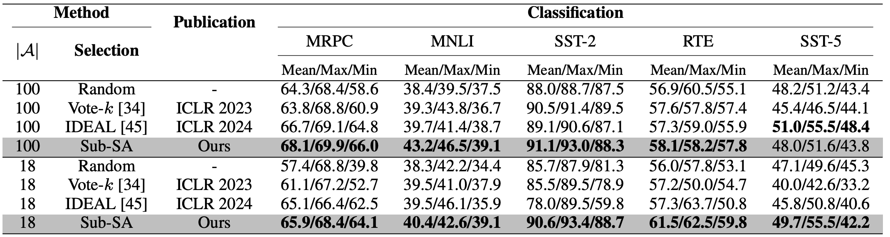

## Sub-SA: Strengthen In-context Learning via Submodular Selective Annotation

Paper Link: https://arxiv.org/abs/2407.05693

### Abstract
In-context learning (ICL) leverages in-context examples
as prompts for the predictions of Large Language Models (LLMs).
These prompts play a crucial role in achieving strong performance.
However, the selection of suitable prompts from a large pool of labeled
examples often entails significant annotation costs. To address this
challenge, we propose Sub-SA (Submodular Selective Annotation), a
submodule-based selective annotation method. The aim of Sub-SA is
to reduce annotation costs while improving the quality of in-context
examples and minimizing the time consumption of the selection process. In Sub-SA, we design a submodular function that facilitates
effective subset selection for annotation and demonstrates the characteristics of monotonically and submodularity from the theoretical perspective. Extensive experiments conducted on diverse models and
datasets demonstrate the superiority of Sub-SA over previous methods, achieving millisecond(ms)-level time selection and remarkable
performance gains. The efficiency and effectiveness of Sub-SA make
it highly suitable for real-world ICL scenarios.

### Pipeline


### SubSA


Run Code:

	```
        python main.py  \
        --model_cache_dir models \
        --data_cache_dir datasets \
        --task_name rte \
        --selective_annotation_method diversity \
        --prompt_retrieval_method similar \
        --annotation_size 18 \
        --cuda_id 0 \
        --model_name EleutherAI/gpt-j-6B \
        --seed 1  \
	```
### Performance


### Citation

```
@article{qian2024sub,
  title={Sub-SA: Strengthen In-context Learning via Submodular Selective Annotation},
  author={Qian, Jian and Sun, Miao and Zhou, Sifan and Zhao, Ziyu and Hun, Ruizhi and Chiang, Patrick},
  journal={arXiv preprint arXiv:2407.05693},
  year={2024}
}
```


